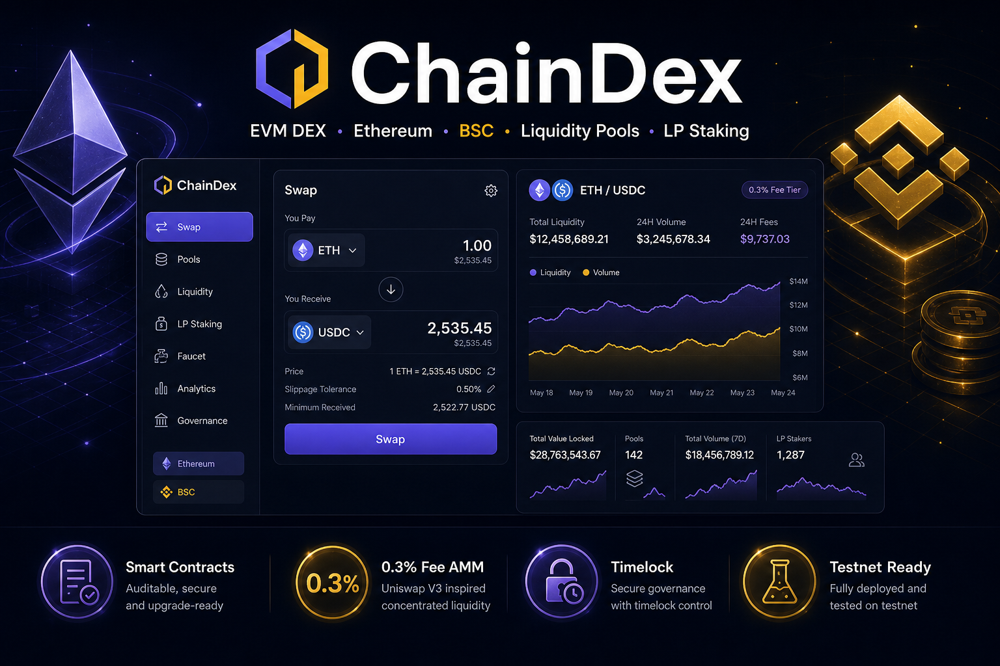
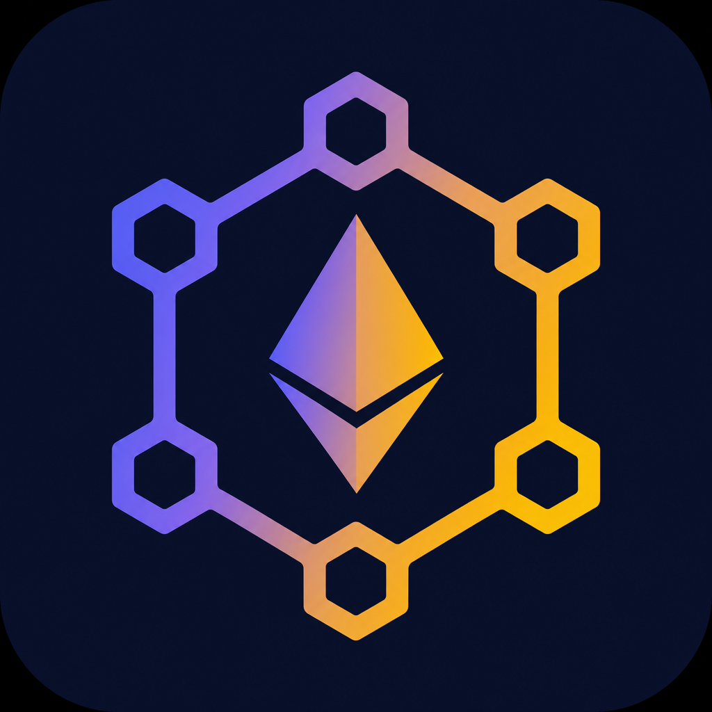
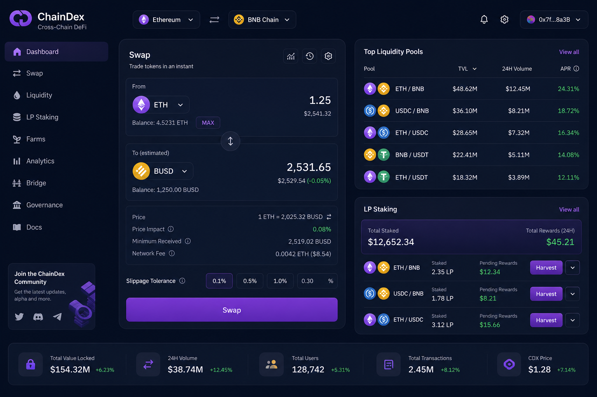
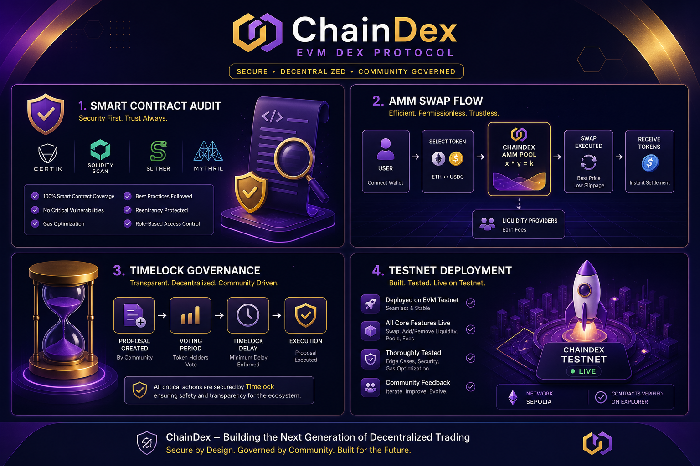

<p align="center">
  
</p>

<p align="center">
  
</p>

<h1 align="center">ChainDex — Production-Ready EVM DEX</h1>

<p align="center">
  <strong>AMM Swaps · Liquidity Pools · LP Staking · Ethereum Sepolia · BSC Testnet</strong>
</p>

<p align="center">
  <a href="LICENSE"></a>
  <a href="https://ethereum.org"></a>
  <a href="https://www.bnbchain.org"></a>
</p>

<p align="center">
  
  
  
  
</p>

<p align="center">
  <a href="#quick-start">🚀 Quick Start</a> ·
  <a href="docs/ARCHITECTURE.md">🏗 Architecture</a> ·
  <a href="docs/PRODUCTION.md">🔒 Production</a> ·
  <a href="docs/SECURITY.md">🛡 Security</a>
</p>

---

## Portfolio gallery

| Dashboard | Feature showcase |
|:---:|:---:|
|  |  |

All images → [`assets/`](./assets/) (banner, logo, dashboard, showcase).

---

## Production readiness

| Layer | Status |
|---|---|
| Smart contracts | Timelock admin, pausable farm, fixed-supply CDX, auto-create pairs |
| Tests | 11+ Hardhat tests + E2E simulator |
| Frontend | Slippage, deadline, env-based addresses, `/deployment.json` |
| Ops | Docker, CI, verify scripts, `docs/PRODUCTION.md` |
| External audit | **Required before mainnet** — see `docs/SECURITY.md` |

---

## Features

- **DexFactory / DexPair / DexRouter** — Uniswap V2-style AMM (0.3% fee)
- **CDXToken** — fixed max supply reward token
- **RewardFarm** — pre-funded emissions, pause, Ownable2Step
- **TimelockController** — 48h delay on farm ownership
- **Next.js UI** — swap, pools, stake

---

## Quick start

```bash
npm install && npm test && npm run e2e
npx hardhat node
npx hardhat run scripts/deploy.js --network localhost
cd frontend && npm install && npm run dev
```

Open http://localhost:3001 — UI loads addresses from `frontend/public/deployment.json`.

### Testnet deploy

```bash
npx hardhat run scripts/deploy.js --network sepolia
npx hardhat run scripts/verify.js --network sepolia
```

See **[docs/PRODUCTION.md](./docs/PRODUCTION.md)** for the full checklist.

---

## Project structure

```
evm_dex_defi/
├── contracts/       Solidity (Factory, Pair, Router, Farm, CDX, Timelock)
├── test/            Unit + production tests
├── simulator/       E2E pipeline
├── scripts/         deploy.js, verify.js
├── frontend/        Next.js dashboard
├── subgraph/        The Graph indexer (stub)
└── docs/            PRODUCTION.md, SECURITY.md, ARCHITECTURE.md
```

---

## License

MIT © **[Loc Nguyen Huu](https://github.com/lokinhh)**
