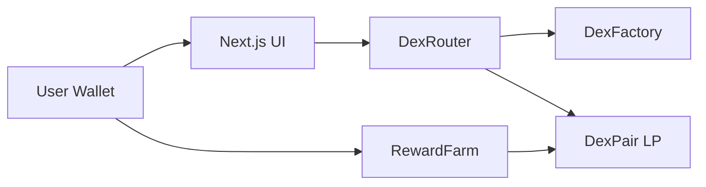

# ChainDex Architecture

## Overview

ChainDex is a Uniswap V2-style AMM DEX with an optional MasterChef-style reward farm. It targets EVM chains (Ethereum Sepolia, BSC Testnet) with the same contract bytecode.

## Smart contracts

### DexFactory
- Deploys `DexPair` instances via CREATE2
- Canonical token ordering (`token0 < token1`)
- Optional protocol fee setter (extensible)

### DexPair
- Holds two ERC-20 reserves
- `mint` — mint LP tokens when liquidity is added
- `burn` — redeem underlying tokens
- `swap` — constant-product swap with 0.3% fee (`997/1000`)
- `ReentrancyGuard` on state-changing functions

### DexRouter
- `addLiquidity` / `removeLiquidity`
- `swapExactTokensForTokens`
- `swapExactETHForTokens` via `WETH9`
- Deadline and slippage guards

### RewardFarm
- Stake LP tokens (pool 0 = main pair)
- Emits `CDX` reward token per second
- `deposit`, `withdraw`, `harvest`

## Frontend

- **wagmi v2** + viem for wallet and contract calls
- Pages: Swap, Pools, Stake
- Supports MetaMask / WalletConnect

## Testing

`test/Dex.test.js` covers:
1. Add liquidity
2. Token swap with fee
3. Remove liquidity
4. LP staking + harvest
5. ETH wrap + swap path

## Deployment

`scripts/deploy.js` writes `deployments/{chainId}.json` with all contract addresses.
